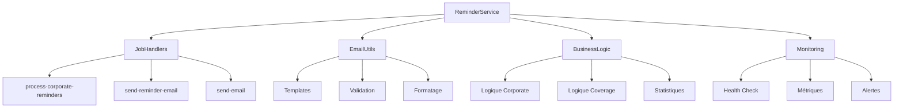

# 📁 Structure Modulaire - ReminderService Lite

## 🎯 Architecture Décomposée

Le fichier `index.js` monolithique de **1113 lignes** a été décomposé en **5 modules** spécialisés pour une meilleure maintenabilité, tout en gardant l'esprit "lite" sans couches d'abstraction complexes.

```
lite/
├── 📄 index.js           (317 lignes) - Classe principale simplifiée
├── 📄 handlers.js        (285 lignes) - Gestionnaires de tâches BullMQ
├── 📄 email-utils.js     (342 lignes) - Utilitaires emails et templates
├── 📄 business-logic.js  (590 lignes) - Logique métier remboursements
├── 📄 monitoring.js      (511 lignes) - Surveillance et métriques
├── 📄 example.js         (350 lignes) - Exemples d'utilisation
├── 📄 package.json       - Configuration NPM
├── 📄 README.md          - Documentation complète
└── 📄 STRUCTURE.md       - Ce fichier
```

## 🔧 Modules Détaillés

### 1. **index.js** - Classe Principale (317 lignes)
```javascript
const JobHandlers = require('./handlers');
const EmailUtils = require('./email-utils');
const BusinessLogic = require('./business-logic');
const Monitoring = require('./monitoring');

class ReminderService {
  constructor(config) {
    // Configuration centralisée
    this.jobHandlers = new JobHandlers(this);
    this.emailUtils = EmailUtils; // Statique
    this.businessLogic = new BusinessLogic(this);
    this.monitoring = new Monitoring(this);
  }

  // Méthodes de délégation vers les modules
  async processCorporateReimbursement(reimbursement, currentDate) {
    return await this.businessLogic.processCorporateReimbursement(reimbursement, currentDate);
  }
}
```

**Responsabilités :**
- ✅ Configuration et initialisation
- ✅ Orchestration des modules
- ✅ API publique (délégation)
- ✅ Lifecycle management (start/stop)

### 2. **handlers.js** - Gestionnaires de Tâches (285 lignes)
```javascript
class JobHandlers {
  constructor(service) {
    this.service = service;
  }

  createHandlers() {
    return {
      'process-corporate-reminders': async (data, job) => { /* ... */ },
      'process-coverage-reminders': async (data, job) => { /* ... */ },
      'send-reminder-email': async (data, job) => { /* ... */ },
      'send-email': async (data, job) => { /* ... */ },
      // ... autres handlers
    };
  }
}
```

**Responsabilités :**
- ✅ Handlers BullMQ spécialisés
- ✅ Traitement des jobs de rappels
- ✅ Handlers emails génériques
- ✅ Gestion progression et erreurs

### 3. **email-utils.js** - Utilitaires Email (342 lignes)
```javascript
class EmailUtils {
  static getEmailTemplates() { /* Templates par défaut */ }
  static renderTemplate(templateName, data) { /* Rendu */ }
  static getPriorityValue(priority) { /* Conversion priorité */ }
  static validateEmailData(emailData) { /* Validation */ }
  static formatEmailData(to, subject, content, options) { /* Formatage */ }
  // ... méthodes utilitaires
}
```

**Responsabilités :**
- ✅ Templates d'emails (welcome, newsletter, rappels)
- ✅ Rendu de templates avec variables `{{name}}`
- ✅ Validation et formatage des données
- ✅ Gestion des priorités et options BullMQ
- ✅ Utilitaires avancés (nettoyage, rapports)

### 4. **business-logic.js** - Logique Métier (590 lignes)
```javascript
class BusinessLogic {
  constructor(service) {
    this.service = service;
  }

  async processCorporateReimbursement(reimbursement, currentDate) {
    // Logique Corporate spécialisée
  }

  async processCoverageReimbursements(healthCoverageId, reimbursements, currentDate) {
    // Logique Coverage avec groupement
  }

  calculateReimbursementStats(reimbursements, currentDate) {
    // Statistiques et analyses
  }
}
```

**Responsabilités :**
- ✅ Logique Corporate (10 premiers jours du mois)
- ✅ Logique Coverage (groupement par health-coverage)
- ✅ Calculs de dates et échéances
- ✅ Récupération et validation des destinataires
- ✅ Analyse d'urgence et statistiques
- ✅ Filtrage et tri des remboursements

### 5. **monitoring.js** - Surveillance (511 lignes)
```javascript
class Monitoring {
  constructor(service) {
    this.service = service;
  }

  setupMonitoring() {
    // Configuration des events BullMQ
    // Alertes automatiques
  }

  async getStats() {
    // Métriques temps réel
  }

  async healthCheck() {
    // Vérification santé système
  }
}
```

**Responsabilités :**
- ✅ Monitoring BullMQ (events, progression)
- ✅ Système d'alertes intégré
- ✅ Métriques temps réel en mémoire
- ✅ Health check complet
- ✅ Persistance MongoDB (logs, emails)
- ✅ Rapports de performance
- ✅ Export Prometheus et dashboard HTML

## 🔄 Flux de Délégation



## ✅ Avantages de la Modularisation

### **🎯 Maintenabilité**
- **Séparation des responsabilités** : Chaque module a un rôle précis
- **Modules indépendants** : Modifications isolées sans impact global
- **Code lisible** : Fichiers de taille raisonnable (285-590 lignes max)

### **🚀 Performance**
- **Pas de couche d'abstraction** : Délégation directe, zéro overhead
- **Chargement modulaire** : Only what you need
- **Optimisations ciblées** : Par module selon ses besoins

### **🔧 Extensibilité**
- **Ajout de handlers** : Juste dans `handlers.js`
- **Nouveaux templates** : Seulement dans `email-utils.js`
- **Règles métier** : Uniquement dans `business-logic.js`
- **Monitoring avancé** : Extension dans `monitoring.js`

### **🧪 Testabilité**
- **Tests unitaires** : Par module avec mocks simples
- **Tests d'intégration** : Via la classe principale
- **Isolation des erreurs** : Erreurs localisées par module

## 📊 Comparaison Avant/Après

| Aspect | **Avant (Monolithique)** | **Après (Modulaire)** |
|--------|---------------------------|------------------------|
| **Lignes total** | 1113 lignes | 1113 lignes réparties |
| **Fichier principal** | 1113 lignes | 317 lignes (-71%) |
| **Modules** | 1 gros fichier | 5 modules spécialisés |
| **Responsabilités** | Tout dans une classe | Séparées par domaine |
| **Lisibilité** | Difficile à naviguer | Structure claire |
| **Maintenance** | Modifications risquées | Changements isolés |
| **Tests** | Tests complexes | Tests ciblés par module |

## 🔍 API Inchangée

**L'API publique reste identique** - Aucun impact sur l'utilisation :

```javascript
const ReminderService = require('./lite');

const service = new ReminderService(config);
await service.initialize();

// Toutes les méthodes fonctionnent exactement pareil
await service.sendEmail(to, subject, content, options);
await service.forceReminderExecution('both');
const stats = await service.getStats();
```

## 🎯 Recommandations d'Usage

### **✅ Parfait pour :**
- **Développement en équipe** : Chaque dev peut se concentrer sur un module
- **Maintenance continue** : Corrections et améliorations ciblées
- **Extensions futures** : Ajout de fonctionnalités sans casser l'existant
- **Debug et monitoring** : Problèmes isolés par module

### **📝 Conventions :**
- **Délégation explicite** : Toutes les méthodes publiques délèguent clairement
- **Injection de service** : Chaque module reçoit `this.service` pour accès aux autres
- **Méthodes statiques** : `EmailUtils` pour les utilitaires sans état
- **Responsabilités claires** : Un module = un domaine métier

## 🚀 Migration Transparente

La modularisation est **100% transparente** :
- ✅ **Même API** : `require('./lite')` fonctionne identiquement
- ✅ **Même configuration** : Paramètres inchangés
- ✅ **Même fonctionnalités** : Tous les features conservés
- ✅ **Même performance** : Délégation directe sans overhead
- ✅ **Compatibilité totale** : Code client inchangé

**La décomposition améliore la maintenabilité tout en gardant l'esprit "lite" !** 🎉